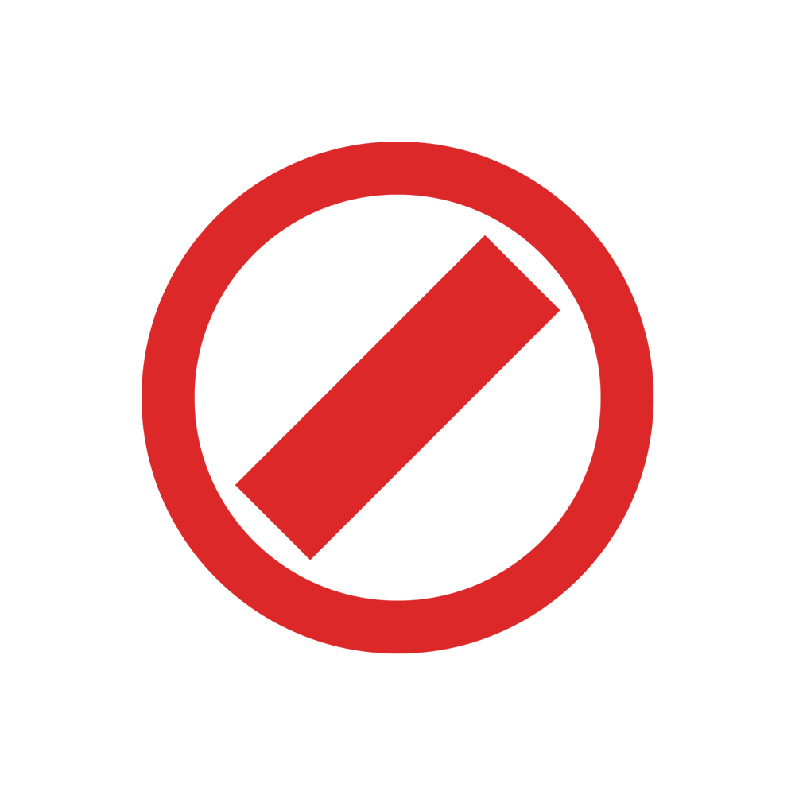

<p align="center">
  
</p>

<h1 align="center">BetWall</h1>

<p align="center">
  A tiny Windows tray app that blocks casino games across every browser — even when DNS/VPN extensions would normally get around a hosts-file block.
</p>

---

## What it does

- Lives in the system tray. Double-click the icon (or use **Open control panel**) to manage it.
- Watches every running browser's address bar via **Windows UI Automation** and closes the tab (`Ctrl+W`) the instant it sees a blocked URL.
- Because it reads the URL straight from the browser UI, it works regardless of VPN extensions, proxy extensions, or custom DNS.
- Covers **Chrome, Edge, Firefox, Brave, Opera, Vivaldi, Arc, Zen, LibreWolf**.
- **TOTP 2FA lock** — on first run you scan a QR with any authenticator app. After that, every change (toggling a game, pausing the blocker, quitting) requires a 6-digit code. You can't just rage-click it off.
- Installs itself to `%LOCALAPPDATA%\BetWall\` and auto-starts on login.

## Casinos supported

Pre-seeded with 18 casinos (Stake, Shuffle, BC.Game, Rainbet, Roobet, Gamdom, Thrill, Razed, Chips, Shock, Menace, MetaWin, Yeet, Winna, Acebet, 500 Casino, Spartans, Degen). Each casino has a **block all** toggle, and the four most-researched ones (Stake, Shuffle, Roobet, Thrill) come with their originals already mapped (Dice, Limbo, Plinko, Mines, Crash, Hilo, Keno, Wheel, Blackjack, Baccarat, Roulette, Diamonds, Dragon Tower, Slide, Video Poker, Tower, Chicken, Mission Uncrossable, …).

You can add any custom game via the panel — pick a casino from the dropdown and paste the path (e.g. `/casino/games/dice`), or pick **Custom** and paste a full URL pattern.

## Building

Requires Rust + the `x86_64-pc-windows-gnu` target. On macOS, install `mingw-w64` for cross-compilation:

```sh
brew install mingw-w64
rustup target add x86_64-pc-windows-gnu
cargo build --release --target x86_64-pc-windows-gnu
```

The binary lands at `target/x86_64-pc-windows-gnu/release/betwall.exe`.

On Windows, just:

```sh
cargo build --release
```

## How it works

| Module | Responsibility |
| --- | --- |
| `app.rs` | Tray icon, event loop, menu |
| `install.rs` | Self-copies to `%LOCALAPPDATA%`, strips Mark-of-the-Web |
| `autostart.rs` | HKCU `Run` registry entry + Startup-folder VBS shortcut |
| `monitor.rs` | Polls browser address bars via UIA, sends `Ctrl+W` on match |
| `server.rs` | Local HTTP control panel on `127.0.0.1:<random>` |
| `totp.rs` | RFC 6238 TOTP (HMAC-SHA1, base32 secret) |
| `config.rs` | JSON config at `%APPDATA%\betwall\config.json` |

## Uninstalling

1. Open the panel, enter your 2FA code, click **Quit**.
2. Delete `%LOCALAPPDATA%\BetWall\`.
3. Delete `%APPDATA%\betwall\`.
4. Remove the `BetWall` entry from the HKCU `Run` registry key and from `%APPDATA%\Microsoft\Windows\Start Menu\Programs\Startup\BetWall.vbs`.

If you lose your 2FA secret, step 4 is the only way out.
